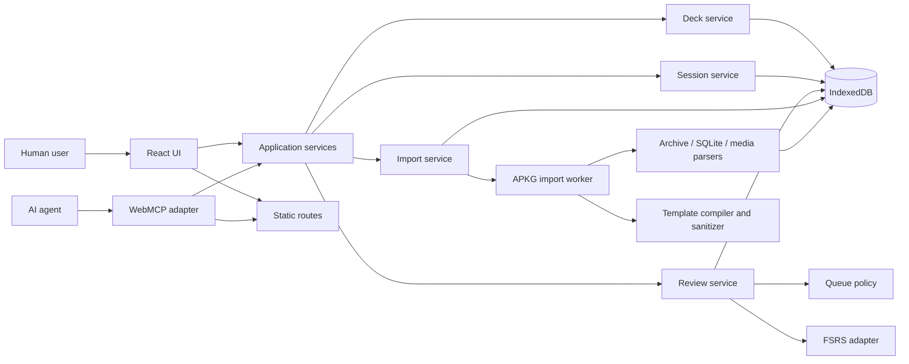
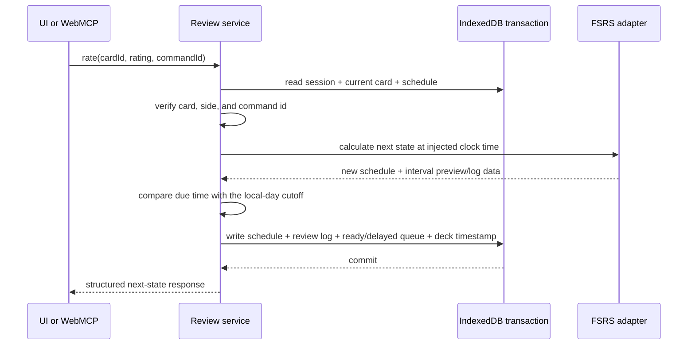
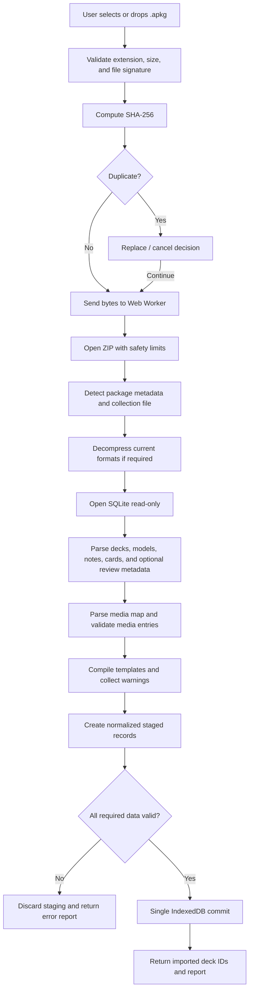
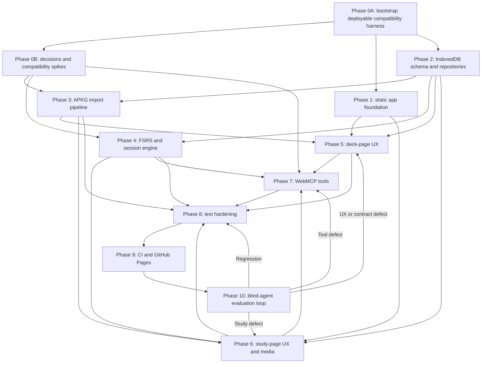

# WebMCP Anki — Product and Technical Implementation Plan

**Status:** Factory-ready planning baseline; implementation is gated by the
Phase 0 decisions and compatibility evidence below  
**Target:** Local-first, static Next.js application deployable to GitHub Pages  
**Primary runtime:** Browser  
**Package manager and test runner:** Bun  
**Persistence:** IndexedDB, with `sessionStorage` used only as a transient active-session pointer  
**Scheduler:** FSRS through a pinned `ts-fsrs` dependency  

---

## 1. Executive summary

WebMCP Anki is a two-screen, local-first flashcard application:

1. **Decks page** — lists imported decks, imports `.apkg` files, removes decks, and starts study sessions.
2. **Study page** — renders the current card, flips front/back, shows progress, and applies Again/Hard/Good/Easy ratings.

The application is a static Next.js export. Imported decks, media, sessions, and review history live entirely in the browser. The user interface and WebMCP tools must call the same application-service layer so that agent actions and human actions always produce identical state transitions.

The most important implementation choices are:

- Use **IndexedDB**, not `localStorage`, for decks, card HTML, media blobs, scheduler records, review logs, and resumable sessions.
- Use static routes: `/` and `/study/?deck=<deck-id>`. Do not use runtime-generated dynamic routes for imported deck IDs.
- Use a pinned **FSRS library** rather than implementing the scheduling equations in application code.
- Treat every `.apkg` file and every card body as **untrusted input**.
- Parse packages in a Web Worker and commit an import only after the whole package has validated.
- Keep the WebMCP integration behind an adapter because the browser API is experimental and may change.
- Make GitHub Pages/WebMCP compatibility a Phase 0 deployment gate, especially origin isolation and origin-trial behavior.

---

## 2. Product definition

### 2.1 Goals

The release must let a user:

- Open the site with no account and no backend.
- See a small default deck on first launch.
- Import one or more decks from a valid `.apkg` file by file picker or drag-and-drop.
- Keep imported content and study history across reloads and browser restarts.
- Remove an imported deck and all of its dependent local data.
- Start or resume today’s study session with an intake of up to 20 eligible
  cards. Cards scheduled again before the next local-day cutoff remain in that
  session, so total presentations may exceed 20.
- Reveal the back of a card and rate it Again, Hard, Good, or Easy.
- See scheduler interval previews on the four rating buttons.
- Study text, images, and audio from supported Anki cards.
- Complete the same workflow through WebMCP tools.
- Use the deployed build at a GitHub Pages URL.

### 2.2 Explicit non-goals for the first release

- AnkiWeb synchronization.
- Editing notes, templates, or decks.
- Exporting modified decks back to `.apkg`.
- Add-on compatibility.
- Executing arbitrary JavaScript embedded in card templates.
- Exact pixel or scheduler parity with desktop Anki.
- Exact preservation of imported review history. The recommended first-release behavior is to import content and start WebMCP Anki scheduling fresh.
- Full WCAG certification, localization, dark mode, or theme customization.

Even though a full accessibility program is out of scope, controls must still use semantic HTML, stable accessible names, focusable buttons, and predictable keyboard behavior. This is necessary for reliable automated tests and blind-agent operation.

### 2.3 Product decisions that must be locked before implementation

The table below records the customer-confirmed MVP baseline. Record any later
change in `docs/temp/meta.md` so factory workers do not independently reinterpret
these decisions.

| Decision | Confirmed MVP behavior |
|---|---|
| Daily intake | Each session admits up to 20 currently eligible cards; same-day requeues may make total presentations exceed 20 |
| Session queue | Ratings immediately update FSRS. Any Again/Hard/Good/Easy result due before the next local-day cutoff remains in today’s session and reappears when due |
| Additional same-day sessions | When the current session is complete, selecting the deck again creates the next numbered session for that day from any other eligible cards |
| Imported scheduling | Start fresh; retain imported source IDs and raw review metadata only for diagnostics/future migration |
| Package containing multiple decks | Import each deck as a separate row, preserving its full Anki name such as `Languages::Spanish` |
| Duplicate package | Detect by SHA-256 and ask the user to replace the prior import or cancel; default is cancel |
| Delete behavior | Confirmation dialog, then transactional cascade deletion |
| Card rating before reveal | Rating buttons remain visible to match the mock, but are disabled until the back is shown |
| Suspend control in mock | MVP. Suspension is durable, excludes the card from queues, and has a deck-level recovery action plus matching WebMCP contracts |
| Missing/unsupported card feature | Render supported content and show a non-blocking warning in the import report |

The MVP deliberately includes same-day learning/relearning queues. A later
“Anki parity” milestone may refine learn-ahead and deck-option behavior and add
preservation of historical scheduling without changing the public routes.

---

## 3. User experience specification

## 3.1 Shared application shell

The checked-in reference images establish the following visual baseline:

- `references/deck-page.png` is the desktop deck-page reference.
- `references/card-page.png` is the desktop study-page reference.
- The written responsive and state requirements in this document are
  authoritative where a state or mobile layout is not pictured.
- The pictured **Suspend** control is part of the MVP. Unpictured recovery is a
  deck-level **Restore suspended cards** action.

- Very light neutral page background.
- Centered white surface on the deck page, with a large radius, subtle border, and restrained shadow.
- Dark navy primary text, muted blue-gray metadata, and a saturated blue primary action.
- White card surfaces with light borders.
- Semantic rating colors: red for Again, amber/orange for Hard, green for Good, and blue for Easy.
- Large whitespace and generous touch targets.

Use shadcn primitives and Tailwind tokens rather than one-off styles wherever possible. Add semantic application tokens for rating colors because they are domain concepts rather than generic primary/secondary colors.

Recommended page behavior:

- Desktop content maximum width: approximately 68–76rem.
- Mobile horizontal padding: 1rem.
- Deck rows and study controls must remain usable at 320 CSS pixels.
- Motion must be subtle and must not be required to understand a state change.
- All asynchronous states have visible text, not only spinners.

## 3.2 Decks page

### Normal state

The page contains:

- Heading: **Your Decks**.
- Supporting copy: **Manage and study your flashcard decks.**
- Primary **Import Deck** button.
- A list of deck rows.

Each deck row shows:

- Deterministic icon/avatar.
- Deck name.
- Total card count.
- Due card count when non-zero.
- Last-studied relative time, or **Not studied yet**.
- A row-level remove button with a stable label such as **Remove Spanish Vocabulary**.
- A separate row activation area that starts or resumes study.
- A suspended-card count when non-zero and a secondary **Restore suspended
  cards in {deck name}** action.

The remove button must not bubble into the row activation handler.

### Import interactions

Both of these launch the same importer service:

1. Clicking **Import Deck** opens a hidden file input accepting `.apkg`.
2. Dragging an `.apkg` anywhere over the page displays a clear drop overlay; dropping begins validation.

Import states:

- Idle.
- Reading file.
- Validating archive.
- Decompressing collection.
- Parsing notes/cards/templates.
- Importing media.
- Committing to IndexedDB.
- Success report.
- Recoverable failure.
- Cancelled.

The UI should show stage text and counts where available. The user may cancel before the commit transaction begins. A failed or cancelled import must leave no partial deck records.

### Empty and first-run states

- On a genuinely new database, seed exactly one bundled **Spanish Basics** deck.
- The seed content must be original project content covered by the repository
  license, contain at least 20 safe text cards, and live in a deterministic
  fixture reused by unit, component, and browser tests.
- Record a `seedInstalled` marker so deleting that deck does not make it reappear.
- If the user later removes all decks, show an empty state with an Import Deck call to action.

### Removal

Selecting remove opens a confirmation dialog containing the deck name and the number of cards/media items that will be deleted. Confirming performs a single cascade operation. If other decks from the same package still reference package media or notes, those shared records remain; orphaned notes and media are garbage-collected only after the last reference is removed. On failure, the row remains and the user sees a durable error message.

## 3.3 Study page

The static route is `/study/?deck=<deck-id>`.

### Header

- Deck icon and name on the left.
- Session progress such as `15 / 20` and a progress bar. The denominator is the
  currently planned presentation count and grows when a rating requeues a card
  for later today.
- Home/close button on the right, labelled **Return to decks**.

The close action persists the current session and returns home. Re-entering the
deck on the same local day resumes the latest incomplete session. If that
session is complete, re-entering creates the next numbered session for today
from cards that are then eligible and were not consumed as current intake.

### Flashcard

The flashcard surface contains:

- Side label: **FRONT** or **BACK**.
- Sanitized card content.
- Explicit **Show Answer** or **Show Front** control.
- The card surface itself may also toggle when clicked, but the explicit control remains available.

Supported first-release content:

- Plain text and Unicode.
- Safe HTML formatting.
- Images referenced by the package media map.
- Audio referenced with Anki’s sound syntax.
- Basic cloze deletion.
- `FrontSide` and common field interpolation.
- Basic conditional sections.
- Deck/model CSS subject to the card sandbox policy.

Unsupported content must not execute. This includes arbitrary script, external network requests, forms, embedded pages, and advanced template filters not implemented by the renderer.

### Rating controls

The four controls display the scheduler preview and rating label:

- Again.
- Hard.
- Good (the standard Anki label for the middle/default successful response; do
  not rename it **Medium**).
- Easy.

While the front is visible, they are present but disabled. After reveal, they become enabled. Selecting one must perform a single atomic review operation and then move to the next card.

Every rating uses the scheduler’s computed due timestamp. If that timestamp is
before the next local-day cutoff, the card stays in the current session’s
delayed queue and reappears when due. If no card is ready but delayed cards
remain today, show the next due time and allow the user to leave and resume.

The pictured **Suspend** action is available on either side. It atomically marks
the current card suspended, removes all pending occurrences from the session,
and advances without creating a review log. The deck page exposes a recoverable
bulk restore action for that deck.

Recommended keyboard shortcuts:

- `Space`: flip.
- `1`: Again.
- `2`: Hard.
- `3`: Good.
- `4`: Easy.
- `Escape`: return home.

Shortcuts must not fire while focus is inside an interactive media control.

### Completion and no-card states

The page remains the same route and replaces the card area with a completion panel when the queue is exhausted. It shows:

- Reviews completed.
- Rating counts.
- Elapsed session time.
- Next due time when known.
- Return-to-decks action.

A deck with no eligible cards shows **You are caught up** instead of creating
an empty session. A session with no ready card but one or more delayed cards due
before the next local-day cutoff shows **Next card in …** and is not complete.
A session completes only when it has no ready or delayed same-day entries. A
missing/deleted deck shows a recoverable error and a return-home action.

---

## 4. Application architecture

The architecture has five layers:

1. **Presentation** — Next.js pages and React components.
2. **Application services** — deck, import, session, review, and navigation use cases.
3. **Domain** — scheduler adapter, queue policy, entities, and errors.
4. **Infrastructure** — IndexedDB, workers, package parsing, rendering, clock, and ID generation.
5. **Agent adapter** — WebMCP registration and structured tool responses.

Both React event handlers and WebMCP handlers call the same application services. Neither may write IndexedDB directly.



### 4.1 Recommended repository structure

```text
app/
  layout.tsx
  page.tsx                    # deck page
  study/
    page.tsx                  # static study route, deck id from query

components/
  app-shell.tsx
  decks/
    deck-list.tsx
    deck-row.tsx
    empty-decks.tsx
    import-deck-button.tsx
    import-drop-overlay.tsx
    import-progress-dialog.tsx
    import-report-dialog.tsx
    remove-deck-dialog.tsx
  study/
    study-header.tsx
    flashcard.tsx
    card-content-frame.tsx
    audio-control.tsx
    rating-grid.tsx
    session-complete.tsx
    caught-up.tsx
  ui/                         # shadcn components

lib/
  application/
    deck-service.ts
    import-service.ts
    session-service.ts
    review-service.ts
    navigation-service.ts
  domain/
    entities.ts
    scheduler.ts
    queue-policy.ts
    ratings.ts
    errors.ts
  persistence/
    db.ts
    schema.ts
    migrations.ts
    deck-repository.ts
    card-repository.ts
    schedule-repository.ts
    session-repository.ts
    review-log-repository.ts
    media-repository.ts
  import/
    package-detector.ts
    archive-reader.ts
    collection-reader.ts
    legacy-schema-adapter.ts
    current-schema-adapter.ts
    media-map-reader.ts
    template-compiler.ts
    sanitizer.ts
    import-limits.ts
  webmcp/
    bridge.ts
    register-home-tools.ts
    register-study-tools.ts
    schemas.ts
    responses.ts
  platform/
    clock.ts
    ids.ts
    checksum.ts
    object-url-registry.ts
    storage-quota.ts

workers/
  apkg-import.worker.ts

tests/
  fixtures/
    seed-deck.json
    apkg/
      synthetic-legacy.apkg
      synthetic-current.apkg
      synthetic-media.apkg
      corrupt.apkg
      malicious-content.apkg
  unit/
  component/
  integration/
  e2e/
```

---

## 5. Persistence and domain model

## 5.1 Storage policy

Use IndexedDB for all durable application data. Use `sessionStorage` only to cache the active session ID for fast route restoration; IndexedDB remains the source of truth.

Do not store package bytes or media in `localStorage`. It is synchronous, string-only, size-constrained, and unsuitable for media-heavy imports.

All database access goes through repositories. Schema changes require versioned migrations and migration tests.

## 5.2 Stores

### `meta`

| Field | Purpose |
|---|---|
| `key` | Primary key |
| `value` | JSON-serializable metadata |

Required keys include `schemaVersion`, `seedInstalled`, and `seedVersion`.

### `imports`

| Field | Purpose |
|---|---|
| `id` | Generated application ID |
| `sha256` | Duplicate detection, unique index |
| `fileName` | Original file name |
| `fileSize` | Original byte size |
| `packageVersion` | Detected APKG layout |
| `importedAt` | Epoch milliseconds |
| `warnings` | Import warning codes |

### `decks`

| Field | Purpose |
|---|---|
| `id` | Generated application deck ID |
| `importId` | Owning import or `seed` |
| `sourceDeckId` | Original Anki deck ID when present |
| `name` | Full deck name |
| `cardCount` | Cached count |
| `createdAt` | Epoch milliseconds |
| `lastStudiedAt` | Nullable epoch milliseconds |
| `sessionIntakeLimit` | Maximum distinct cards admitted per numbered session; defaults to 20 |
| `schedulerConfigId` | Scheduler configuration reference |

Indexes: `importId`, `name`, `lastStudiedAt`.

### `notes`

| Field | Purpose |
|---|---|
| `id` | Namespaced/generated ID |
| `importId` | Owning package import or `seed` |
| `sourceNoteId` | Original source ID |
| `guid` | Anki GUID when present |
| `modelId` | Source notetype/model ID |
| `fields` | Named field map |
| `tags` | Normalized string array |

### `cards`

| Field | Purpose |
|---|---|
| `id` | Namespaced/generated ID |
| `deckId` | Owning deck |
| `noteId` | Owning note |
| `sourceCardId` | Original card ID |
| `templateOrdinal` | Template number |
| `frontHtml` | Compiled, not yet trusted card HTML |
| `backHtml` | Compiled, not yet trusted card HTML |
| `mediaRefs` | Referenced media names |
| `creationOrder` | Stable new-card ordering |
| `contentWarnings` | Unsupported-template warning codes |

Indexes: `deckId`, `[deckId, creationOrder]`.

### `schedules`

The canonical FSRS record should contain:

| Field | Purpose |
|---|---|
| `cardId` | Primary key |
| `deckId` | Denormalized owning deck ID for indexed due queries |
| `dueAt` | Epoch milliseconds, indexed |
| `stability` | FSRS memory stability |
| `difficulty` | FSRS difficulty |
| `elapsedDays` | FSRS elapsed days |
| `scheduledDays` | Current interval |
| `reps` | Total review count |
| `lapses` | Lapse count |
| `state` | `new`, `learning`, `review`, or `relearning` |
| `lastReviewAt` | Nullable epoch milliseconds |
| `suspended` | Boolean |
| `legacyEaseFactor` | Optional imported compatibility metadata; not used as canonical FSRS state |

Indexes: `[deckId, dueAt]`, `[deckId, state, dueAt]`. The denormalized `deckId` must be maintained in the same transaction as card creation or movement.

Retrievability is derived for a supplied clock time and need not be persisted.

### `sessions`

| Field | Purpose |
|---|---|
| `id` | Generated ID |
| `deckId` | Deck being studied |
| `dayKey` | Local date such as `2026-09-01` |
| `sequence` | One-based session number within `[deckId, dayKey]` |
| `intakeLimit` | Maximum distinct cards admitted when created, default 20 |
| `nextDayAt` | Persisted epoch-millisecond cutoff for the next local day |
| `queueEntries` | Ordered ready/delayed entries containing card ID, due timestamp, and stable ordinal |
| `activeCardId` | Current card ID, nullable while waiting or complete |
| `plannedPresentationCount` | Initial intake plus same-day requeues; may exceed 20 |
| `completedPresentationCount` | Ratings committed in this session |
| `currentSide` | `front` or `back` |
| `ratingCounts` | Again/Hard/Good/Easy totals |
| `startedAt` | Epoch milliseconds |
| `updatedAt` | Epoch milliseconds |
| `completedAt` | Nullable epoch milliseconds |
| `lastCommandIds` | Small bounded idempotency set for agent commands |

Unique index: `[deckId, dayKey, sequence]`. Index `[deckId, dayKey,
completedAt]` supports finding the latest incomplete session. Creation of the
next same-day sequence and selection of its intake occur atomically so repeated
UI or agent requests cannot create competing sessions.

### `reviewLogs`

| Field | Purpose |
|---|---|
| `id` | Generated ID |
| `sessionId` | Session reference |
| `deckId` | Deck reference |
| `cardId` | Card reference |
| `rating` | Again/Hard/Good/Easy |
| `reviewedAt` | Epoch milliseconds |
| `durationMs` | Time on card, when available |
| `before` | Scheduler snapshot |
| `after` | Scheduler snapshot |
| `commandId` | Optional idempotency key |

Indexes: `cardId`, `deckId`, `sessionId`, `reviewedAt`, unique `commandId` when defined.

### `media`

| Field | Purpose |
|---|---|
| `[importId, name]` | Composite primary key |
| `blob` | Binary media |
| `mimeType` | Sniffed/validated type |
| `byteLength` | Size |
| `sha256` | Integrity/deduplication metadata |

## 5.3 Atomic review transaction

A rating must be processed as one transaction across schedules, review logs, sessions, and deck metadata:



The service rejects:

- A card other than the session’s current card.
- A rating while the front is visible.
- A duplicate `commandId`.
- A completed session.
- A missing/deleted deck or card.

---

## 6. Scheduler and queue policy

## 6.1 FSRS adapter

Pin an exact `ts-fsrs` version in `bun.lock`. Wrap it in a small adapter so application code never depends directly on library-specific object shapes.

Recommended configuration baseline:

- Desired retention: `0.90`.
- Maximum interval: configurable, with a conservative high default.
- Fuzz enabled in production.
- Fuzz disabled in deterministic tests.
- All calculations receive an injected clock.

The adapter exposes only:

```ts
interface SchedulerAdapter {
  createNewCard(now: Date): ScheduleState;
  preview(schedule: ScheduleState, now: Date): RatingPreviewMap;
  apply(
    schedule: ScheduleState,
    rating: Rating,
    now: Date,
  ): { schedule: ScheduleState; log: SchedulerLog };
  retrievability(schedule: ScheduleState, now: Date): number | null;
}
```

## 6.2 Queue construction

Each numbered session builds a deterministic intake of at most `intakeLimit`
distinct eligible cards:

1. Due learning cards, oldest due first.
2. Due relearning cards, oldest due first.
3. Due review cards, oldest due first.
4. New cards, ascending `creationOrder`.
5. Stable tie-breaker: application card ID.

Suspended cards are excluded. The intake is truncated to `intakeLimit`, default
20. Cards pending in an incomplete session are not admitted into another
session.

After every rating, update FSRS immediately and compare the resulting `dueAt`
with the persisted `nextDayAt` cutoff:

1. `dueAt < nextDayAt`: append a delayed entry for the card to the current
   session, ordered by `dueAt` and stable ordinal.
2. `dueAt >= nextDayAt`: do not reinsert it into today’s session.

All four ratings follow this rule; **Again** is not special-cased. A card becomes
ready only when the injected clock reaches its delayed entry. The queue and
ordinals survive reloads. Progress is `completedPresentationCount /
plannedPresentationCount`; the denominator grows when a same-day entry is
appended.

When the ready and delayed queues are empty, mark the session complete. A later
deck selection on the same `dayKey` creates `sequence + 1` from cards then
eligible, including cards omitted by an earlier intake. Do not reopen or mutate
a completed session.

## 6.3 Interval previews

When a card is displayed, calculate all four outcomes once and show human-readable due intervals. Recalculate if the clock meaningfully changes before rating or when the card is restored after a long suspension.

The preview shown in the UI and returned from `get_state()` must come from the same scheduler call used by the review service.

## 6.4 Time rules

- Persist timestamps as epoch milliseconds.
- Compute `dayKey` with the browser’s local timezone at session creation.
- Persist `nextDayAt`, the next local-day cutoff calculated at session creation;
  this decides whether every scheduler result belongs to today’s session.
- Inject time in every unit and integration test.
- Define day rollover tests around daylight-saving transitions.
- Relative UI strings may be approximate; scheduler inputs may not be.

## 6.5 Anki behavioral reference

Use upstream Anki as a behavioral reference for queue categories, intraday
learning, day cutoffs, answering, suspension, and restoration:

- [Scheduler state transitions](https://github.com/ankitects/anki/tree/main/rslib/src/scheduler/states)
- [Queue construction and intraday learning](https://github.com/ankitects/anki/tree/main/rslib/src/scheduler/queue)
- Public scheduler messages such as `GetQueuedCards`, `SchedTimingToday`,
  `CongratsInfo`, and suspend/restore operations in
  [scheduler.proto](https://github.com/ankitects/anki/blob/main/proto/anki/scheduler.proto)
- [Reviewer answer/suspend integration](https://github.com/ankitects/anki/blob/main/qt/aqt/reviewer.py)

Anki is AGPL-licensed. Treat it as a behavioral and test-oracle reference; do
not copy its implementation into this repository. Scheduler math remains in
the pinned `ts-fsrs` adapter, while our independently written queue policy
implements the customer-confirmed “same local day means today’s session” rule.

---

## 7. APKG import design

## 7.1 Import pipeline



## 7.2 Required package support

The importer must detect at least:

- Legacy package with `collection.anki2`.
- Legacy/current transition package with `collection.anki21`.
- Current package with `collection.21b`, compressed collection data, and the current media metadata format.

Do not infer the format only from the file extension. Detect package metadata and archive members.

## 7.3 Parsing responsibilities

The normalized parser output should contain:

- Source deck IDs and names.
- Note types/models.
- Field names and values.
- Card templates and template order.
- Deck/model CSS.
- Notes, tags, and source GUIDs.
- Generated cards and stable source card IDs.
- Media names and bytes.
- Optional source scheduling/review metadata retained for diagnostics.

Use format-specific adapters that output one common normalized model. This prevents the rest of the app from depending on historical Anki database layouts.

## 7.4 Template support matrix

### Required

- `{{FieldName}}`.
- `{{FrontSide}}`.
- Basic conditional sections.
- Basic cloze fields.
- Common HTML and inline formatting.
- `[sound:filename]`.
- Package-local image references.
- Model CSS.

### Graceful warning

- Unsupported filters.
- Type-answer fields.
- TTS directives.
- LaTeX rendering not bundled in the MVP.
- JavaScript-dependent templates.
- External resources.

Never silently execute or fetch unsupported content.

## 7.5 Import security limits

Treat the archive as hostile. Enforce configurable limits for:

- Original package size.
- Total uncompressed bytes.
- Entry count.
- Per-entry size.
- Compression ratio.
- Nested archives.
- Parse duration/cancellation.
- Media MIME types.

Reject absolute paths, `..` traversal, duplicate normalized paths, malformed UTF-8 names, and archive members outside the expected namespace.

Open SQLite read-only. Never run SQL embedded in the package. Never execute card scripts.

## 7.6 Card rendering sandbox

Do not mount imported HTML directly into the application document with unrestricted `dangerouslySetInnerHTML`.

Recommended rendering boundary:

- Sanitize the compiled HTML.
- Replace package media references with short-lived blob URLs.
- Render inside a sandboxed iframe or an equivalently isolated renderer.
- Disable scripts, forms, popups, top navigation, and network connections.
- Restrict image/media/font sources to package-local blob/data URLs.
- Revoke object URLs when the card changes or the study page unmounts.

The renderer should return plain text separately for WebMCP output so an agent does not need to interpret raw HTML.

## 7.7 Import errors

Use stable error codes:

- `UNSUPPORTED_FILE_TYPE`.
- `FILE_TOO_LARGE`.
- `DUPLICATE_IMPORT`.
- `INVALID_ZIP`.
- `ARCHIVE_LIMIT_EXCEEDED`.
- `MISSING_COLLECTION`.
- `UNSUPPORTED_PACKAGE_VERSION`.
- `COLLECTION_DECOMPRESSION_FAILED`.
- `SQLITE_OPEN_FAILED`.
- `COLLECTION_SCHEMA_UNSUPPORTED`.
- `MEDIA_MAP_INVALID`.
- `STORAGE_QUOTA_EXCEEDED`.
- `IMPORT_CANCELLED`.
- `IMPORT_COMMIT_FAILED`.

Each error includes a user-facing message, a technical diagnostic, whether it is recoverable, and suggested next action.

---

## 8. WebMCP design

## 8.1 Integration principles

- WebMCP is progressive enhancement. The application remains fully usable when `document.modelContext` is absent.
- Register only tools relevant to the current page.
- Abort/unregister route-scoped tools on navigation or unmount.
- Tool descriptions are static and never contain imported card text.
- Every tool returns JSON-serializable structured output.
- `list_decks` and `get_state` are marked read-only.
- `get_state` is marked as returning untrusted content because card text came from an imported package.
- Tool handlers call application services, not React component methods or repositories.
- Agent-triggered card mutations carry the expected `card_id` and a required
  `command_id`; application services reject stale state and make retry behavior
  deterministic. Human UI handlers call the same services and generate their
  own command IDs.

## 8.2 Common response envelope

```ts
type ToolResult<T> =
  | { ok: true; data: T }
  | {
      ok: false;
      error: {
        code: ToolErrorCode;
        message: string;
        recoverable: boolean;
        suggested_action?: string;
      };
    };
```

Required tool error codes:

- `WRONG_PAGE`.
- `DECK_NOT_FOUND`.
- `NO_ACTIVE_SESSION`.
- `NO_CURRENT_CARD`.
- `ANSWER_NOT_REVEALED`.
- `STALE_CARD`.
- `DUPLICATE_COMMAND`.
- `SESSION_COMPLETE`.
- `STORAGE_ERROR`.
- `NAVIGATION_ERROR`.

## 8.3 `list_decks()`

**Registered on:** decks page.  
**Read-only:** yes.

Input schema:

```json
{
  "type": "object",
  "properties": {},
  "additionalProperties": false
}
```

Output shape:

```ts
interface ListDecksData {
  page: "decks";
  decks: Array<{
    id: string;
    name: string;
    card_count: number;
    due_count: number;
    suspended_count: number;
    last_studied_at: string | null;
    can_start_session: boolean;
  }>;
}
```

The result order must match the visible deck list.

## 8.4 `select_deck(deck_id)`

**Registered on:** decks page.  
**Read-only:** no.

Input schema:

```json
{
  "type": "object",
  "required": ["deck_id"],
  "properties": {
    "deck_id": { "type": "string", "minLength": 1 }
  },
  "additionalProperties": false
}
```

Behavior:

1. Validate the deck.
2. Resume today’s latest incomplete session or create the next deterministic
   numbered session for today from cards currently eligible.
3. Navigate to `/study/?deck=<id>`.
4. Return the resulting page/session state.

## 8.5 `get_state()`

**Registered on:** study page.  
**Read-only:** yes.  
**Untrusted content:** yes.

Output shape:

```ts
interface StudyStateData {
  page: "study";
  deck: {
    id: string;
    name: string;
  };
  session: {
    id: string;
    sequence: number;
    intake_limit: number;
    completed_presentations: number;
    planned_presentations: number;
    remaining: number;
    next_due_at: string | null;
    is_complete: boolean;
  };
  current_card: null | {
    id: string;
    side: "front" | "back";
    front_text: string;
    back_text: string | null;
    has_image: boolean;
    has_audio: boolean;
    interval_previews: {
      again: string;
      hard: string;
      good: string;
      easy: string;
    };
  };
  allowed_actions: Array<"flip" | "again" | "hard" | "good" | "easy" | "suspend" | "go_home">;
}
```

Do not expose `back_text` until the back is visible.

## 8.6 `flip()`

**Registered on:** study page when there is a current card.  
**Read-only:** no, because it changes session/UI state.

Input schema:

```json
{
  "type": "object",
  "required": ["card_id", "command_id"],
  "properties": {
    "card_id": {
      "type": "string",
      "minLength": 1,
      "description": "Expected current card id; used to reject stale actions."
    },
    "command_id": {
      "type": "string",
      "minLength": 1,
      "description": "Unique id that makes retries deterministic."
    }
  },
  "additionalProperties": false
}
```

The call toggles the current side and persists it. Repeating the same
`command_id` returns the original result without toggling a second time. The
result is the same shape as `get_state()`.

The tool description must state that ratings are accepted only while the back is visible.

## 8.7 `set_state(again | hard | good | easy)`

Use a single enum input rather than four separate implementation paths.

**Registered on:** study page when there is a current card.  
**Read-only:** no.

Input schema:

```json
{
  "type": "object",
  "required": ["rating", "card_id", "command_id"],
  "properties": {
    "rating": {
      "type": "string",
      "enum": ["again", "hard", "good", "easy"]
    },
    "card_id": {
      "type": "string",
      "minLength": 1,
      "description": "Expected current card id; used to reject stale actions."
    },
    "command_id": {
      "type": "string",
      "minLength": 1,
      "description": "Unique id for safe, deterministic retries."
    }
  },
  "additionalProperties": false
}
```

Output adds a transition summary:

```ts
interface SetStateData extends StudyStateData {
  transition: {
    reviewed_card_id: string;
    rating: "again" | "hard" | "good" | "easy";
    previous_due_at: string | null;
    next_due_at: string;
    next_card_id: string | null;
  };
}
```

The response reflects any same-day requeue: `planned_presentations` and
`remaining` increase, and `next_due_at` is populated when the session has no
ready card but still has delayed work today.

## 8.8 `suspend(card_id, command_id)`

**Registered on:** study page when there is a current card.  
**Read-only:** no.

The input schema requires `card_id` and `command_id` with the same stale-state
and idempotency semantics as `flip`. The operation atomically sets the schedule
to suspended, removes all ready/delayed occurrences of the card from the
session, advances the session, and returns `StudyStateData` plus
`suspended_card_id`. It does not create a review log or apply an FSRS rating.

## 8.9 `restore_suspended(deck_id, command_id)`

**Registered on:** decks page.  
**Read-only:** no.

This deck-level recovery operation restores every suspended card in the named
deck without changing its FSRS memory state or due timestamp. It returns the
deck ID and restored count. Repeating a command ID is idempotent.

## 8.10 `go_home()`

**Registered on:** study page.  
**Read-only:** no, because it changes page state.

Persist the session, navigate to `/`, and return a minimal home-state result with the visible deck count.

## 8.11 WebMCP registration lifecycle

Create a bridge with a no-op fallback:

```ts
interface WebMcpBridge {
  supported: boolean;
  register(tool: AppTool, signal: AbortSignal): Promise<void>;
}
```

Each route creates one `AbortController`, awaits registration of its tools, and
aborts on unmount. Registration rejection is a progressive-enhancement failure:
the human UI remains usable, the failure is observable in diagnostics, and no
partially registered route toolset is presented as healthy. Feature detection
must distinguish an absent API from secure-context, origin-isolation,
permissions-policy, invalid-schema, and duplicate-registration failures.
Component tests use a fake bridge. Browser integration tests use a test
implementation of `document.modelContext`; a separate pinned WebMCP-enabled
browser smoke test verifies the real API, including cancellation during an
in-flight call and navigation while a call settles.

Use the GoogleChromeLabs WebMCP pizza-maker demo as the initial external
compatibility oracle:
`https://github.com/GoogleChromeLabs/webmcp-tools/tree/main/demos/pizza-maker`.
Its live GitHub Pages deployment proves origin-trial exposure, imperative tool
registration, discovery, execution, and UI mutation before our application is
involved. Test both native/flagged behavior and any polyfill path separately;
never let a polyfill result masquerade as proof of native WebMCP support.

---

## 9. Implementation dependency graph



---

## 10. Phased task plan

Estimates below are relative sizes, not calendar promises: **S** is focused, **M** is moderate, **L** is substantial, and **XL** contains meaningful unknowns.

## Phase 0A — Bootstrap compatibility harness

- [ ] **P0A.1 — Establish the minimal static-export application harness** (M)  
  Create only enough Next.js/Bun structure to export `/` and `/study/`, run a
  browser smoke test, and deploy a diagnostic page at the required project
  Pages base path. Phase 1 extends this harness; it does not create a second
  scaffold.
- [ ] **P0A.2 — Establish CI and Pages credentials/configuration** (S)  
  Confirm Pages source, Actions permissions, protected environment behavior,
  and whether the operator has authority to enable or change them.
- [ ] **P0A.3 — Record the release browser matrix** (S)  
  Pin the WebMCP-enabled Chromium build used for agent acceptance. Support the
  human UI in current stable desktop Chromium, with mobile behavior verified in
  a Chromium mobile viewport. Other browsers are best-effort for the MVP and
  must degrade cleanly when WebMCP is absent.

**Exit criterion:** the required URL serves a minimal static export, both
routes survive the project base path/direct reload, CI can deploy it, and the
browser matrix is recorded.

## Phase 0B — Decisions and technical spikes

- [ ] **P0B.1 — Audit the existing implementation** (M)  
  Inventory routes, components, storage code, scheduler code, tests, and deployment workflow. Mark each item keep/refactor/replace.
- [ ] **P0B.2 — Pin toolchain versions** (S)  
  Commit Bun version, Next.js version, Playwright version, and exact scheduler dependency.
- [ ] **P0B.3 — Static-routing regression proof** (S)  
  Prove `/` and `/study/?deck=<id>` work from a GitHub project-pages base path and on direct reload.
- [ ] **P0B.4 — WebMCP deployment spike** (M)  
  First reproduce native registration/discovery/execution against the
  GoogleChromeLabs pizza-maker demo with its polyfill blocked. Then, on the
  actual GitHub Pages host, verify a WebMCP origin-trial token issued for
  `https://portpowered.github.io`, API exposure without a polyfill or browser
  feature flag, origin isolation, route registration/unregistration, and
  structured tool execution. A feature flag is acceptable for local
  development but not deployed-native acceptance. The customer-supplied token
  to install in the deployed document metadata is:

  ```text
  A/MXFu/smsk8zDkOidDtDxnHQbr502frxTfbhB94iRy6Tc8m6BzqVCh3DibOCvEGdPiGm4+ww+AZkNN77vNnTgkAAABpeyJvcmlnaW4iOiJodHRwczovL3BvcnRwb3dlcmVkLmdpdGh1Yi5pbzo0NDMiLCJmZWF0dXJlIjoiV2ViTUNQIiwiZXhwaXJ5IjoxNzk0ODczNjAwLCJpc1RoaXJkUGFydHkiOnRydWV9
  ```
- [ ] **P0B.5 — APKG compatibility spike** (XL)  
  Parse synthetic fixtures plus provenance-recorded exports produced by the
  pinned supported Anki exporter versions in a Worker; prove notes, templates,
  and media can be normalized. Real exports may be checked in only when their
  content and licensing are safe for the repository.
- [ ] **P0B.6 — Select browser parser libraries** (M)  
  Benchmark and choose ZIP, SQLite/WASM, zstd, and protobuf implementations. Record bundle size, licensing, Worker support, cancellation behavior, and CSP requirements.
- [ ] **P0B.7 — Lock product decisions in Section 2.3** (S).

**Exit criterion:** all unknowns that could invalidate WebMCP or supported APKG
formats have evidence-backed answers, and the customer decisions are recorded.

## Phase 1 — Static application foundation

- [ ] **P1.1 — Configure Next static export** (S).
- [ ] **P1.2 — Add project-pages `basePath` and trailing-slash behavior** (S).
- [ ] **P1.3 — Build shared app shell and background** (S).
- [ ] **P1.4 — Install/configure Tailwind and shadcn primitives** (S).
- [ ] **P1.5 — Define semantic design tokens, including ratings** (S).
- [ ] **P1.6 — Add `/` and `/study/` page skeletons** (S).
- [ ] **P1.7 — Add typed domain errors and result helpers** (S).
- [ ] **P1.8 — Add injected clock, ID generator, and navigation abstraction** (S).
- [ ] **P1.9 — Configure Bun unit/component test environment** (M).
- [ ] **P1.10 — Configure Playwright projects for desktop and mobile** (M).

**Exit criterion:** both routes render from the static build and the base test suites run in CI.

## Phase 2 — IndexedDB and repositories

- [ ] **P2.1 — Define schema and indexes** (M).
- [ ] **P2.2 — Implement database open/upgrade/migration flow** (M).
- [ ] **P2.3 — Implement deck/note/card repositories** (M).
- [ ] **P2.4 — Implement schedule/session/review-log repositories** (M).
- [ ] **P2.5 — Implement media repository** (M).
- [ ] **P2.6 — Implement transactional cascade delete** (M).
- [ ] **P2.7 — Implement storage quota diagnostics** (S).
- [ ] **P2.8 — Seed the bundled default deck exactly once** (S).
- [ ] **P2.9 — Add repository and migration tests** (L).

**Exit criterion:** seeded and synthetic records survive reloads; migrations and rollback behavior are tested.

## Phase 3 — APKG import

- [ ] **P3.1 — File picker and drag/drop intake service** (S).
- [ ] **P3.2 — Checksum and duplicate policy** (M).
- [ ] **P3.3 — Worker message protocol with progress/cancellation** (M).
- [ ] **P3.4 — Safe ZIP reader and archive limits** (L).
- [ ] **P3.5 — Package-version detector** (M).
- [ ] **P3.6 — Legacy collection adapter** (L).
- [ ] **P3.7 — Current compressed collection adapter** (XL).
- [ ] **P3.8 — Media-map adapters and MIME validation** (L).
- [ ] **P3.9 — Normalized deck/note/card model** (M).
- [ ] **P3.10 — Template compiler and support warnings** (XL).
- [ ] **P3.11 — Staging validation and all-or-nothing commit** (L).
- [ ] **P3.12 — Import progress and report UI** (M).
- [ ] **P3.13 — Corruption/security fixture suite** (L).

**Exit criterion:** legacy and current synthetic packages import atomically with text, image, and audio references.

## Phase 4 — FSRS and session engine

- [ ] **P4.1 — Scheduler adapter around pinned `ts-fsrs`** (M).
- [ ] **P4.2 — Rating preview formatter** (S).
- [ ] **P4.3 — Deterministic queue policy** (M).
- [ ] **P4.4 — Create/resume daily session service** (M).
- [ ] **P4.5 — Persist front/back side** (S).
- [ ] **P4.6 — Atomic rating service** (L).
- [ ] **P4.7 — Idempotency and stale-card protection** (M).
- [ ] **P4.8 — Completion/caught-up calculations** (S).
- [ ] **P4.9 — Unit and property tests for scheduler invariants** (L).
- [ ] **P4.10 — Same-day delayed queue and numbered-session lifecycle** (L).
- [ ] **P4.11 — Atomic suspend and deck-level restore services** (M).

**Exit criterion:** a frozen-clock test deck produces deterministic queueing, previews, schedule updates, review logs, and resumable progress.

## Phase 5 — Deck page UX

- [ ] **P5.1 — Deck list and deck row components** (M).
- [ ] **P5.2 — Empty and first-run states** (S).
- [ ] **P5.3 — Import button and page-wide drop overlay** (M).
- [ ] **P5.4 — Import progress/report/error states** (M).
- [ ] **P5.5 — Remove confirmation and cascade flow** (M).
- [ ] **P5.6 — Due/last-studied metadata** (S).
- [ ] **P5.7 — Mobile layout and touch behavior** (M).
- [ ] **P5.8 — Component test matrix** (M).
- [ ] **P5.9 — Suspended count and restore action** (M).

**Exit criterion:** empty/one/many/loading/error/importing/removing states work at desktop and mobile widths.

## Phase 6 — Study page UX and card media

- [ ] **P6.1 — Study header and progress** (S).
- [ ] **P6.2 — Flashcard front/back state** (M).
- [ ] **P6.3 — Sandboxed card content renderer** (L).
- [ ] **P6.4 — Object URL/media resolver** (M).
- [ ] **P6.5 — Image rendering** (S).
- [ ] **P6.6 — Audio control and playback-state handling** (M).
- [ ] **P6.7 — Four rating controls with previews** (M).
- [ ] **P6.8 — Keyboard shortcuts** (S).
- [ ] **P6.9 — Missing-deck/caught-up/completion states** (M).
- [ ] **P6.10 — Mobile 2×2 rating grid** (S).
- [ ] **P6.11 — Component and browser tests** (L).
- [ ] **P6.12 — Suspend control and delayed-card waiting state** (M).

**Exit criterion:** users can complete and resume a session containing text, image, and audio cards without imported code escaping the renderer.

## Phase 7 — WebMCP tools

- [ ] **P7.1 — Browser feature-detection bridge** (S).
- [ ] **P7.2 — Route-scoped registration lifecycle** (M).
- [ ] **P7.3 — `list_decks`** (S).
- [ ] **P7.4 — `select_deck`** (M).
- [ ] **P7.5 — `get_state`** (M).
- [ ] **P7.6 — `flip`** (S).
- [ ] **P7.7 — `set_state` with stale/idempotency guards** (M).
- [ ] **P7.8 — `go_home`** (S).
- [ ] **P7.9 — JSON schema and result-contract tests** (M).
- [ ] **P7.10 — Real-browser registration smoke test** (M).
- [ ] **P7.11 — Registration/cancellation/concurrency adversarial tests** (M)  
  Cover rejected registration, duplicate names, route unmount during
  registration, navigation during execution, aborted execution, repeated
  command IDs, distinct concurrent command IDs, and late completion from a
  previous card or route.
- [ ] **P7.12 — `suspend` with stale/idempotency guards** (S).
- [ ] **P7.13 — `restore_suspended` deck recovery tool** (S).

**Exit criterion:** every supported human action produces the same persisted state when invoked through WebMCP, and only valid tools/actions are exposed.

## Phase 8 — Test hardening

- [ ] **P8.1 — Complete unit coverage for queue/scheduler/import utilities** (M).
- [ ] **P8.2 — Complete component state matrix** (L).
- [ ] **P8.3 — IndexedDB browser integration tests** (M).
- [ ] **P8.4 — End-to-end import via file picker** (M).
- [ ] **P8.5 — End-to-end import via drag/drop** (M).
- [ ] **P8.6 — End-to-end 20-card session** (M).
- [ ] **P8.7 — Refresh/resume and day-rollover tests** (M).
- [ ] **P8.8 — Media and hostile-content tests** (L).
- [ ] **P8.9 — Mobile/desktop visual snapshots** (M).
- [ ] **P8.10 — Base-path/static-build tests** (M).
- [ ] **P8.11 — Flake elimination and deterministic fixtures** (M).

**Exit criterion:** the full suite passes repeatedly from a clean checkout and clean browser profile.

## Phase 9 — CI and GitHub Pages

- [ ] **P9.1 — PR workflow: `bun ci`, typecheck, lint, tests, build** (M).
- [ ] **P9.2 — Install Playwright browsers and run e2e** (M).
- [ ] **P9.3 — Upload test reports and traces on failure** (S).
- [ ] **P9.4 — Production static export with repository base path** (S).
- [ ] **P9.5 — Upload `out/` as Pages artifact** (S).
- [ ] **P9.6 — Deploy from protected `main` branch** (S).
- [ ] **P9.7 — Post-deploy route, storage, and WebMCP smoke tests** (M).
- [ ] **P9.8 — Add `release:check` aggregate script** (S).

**Exit criterion:** a passing main build publishes a working Pages URL and a failed gate cannot deploy.

## Phase 10 — Blind-agent evaluation loop

- [ ] **P10.1 — Build isolated browser-profile runner** (M).
- [ ] **P10.2 — Define ten independent blind probes** (M).
- [ ] **P10.3 — Capture tool transcript, retries, final state, and failure classification** (M).
- [ ] **P10.4 — Run cohort, fix defects, and rerun all probes** (variable).
- [ ] **P10.5 — Require two consecutive 10/10 cohorts** (variable).

**Exit criterion:** two consecutive clean cohorts meet the metrics in Section 13.

---

## 11. Test strategy

## 11.1 Unit tests

### Scheduler

- New-card initialization.
- Every rating produces a valid state and future due timestamp.
- Due dates are monotonic where the chosen policy expects them to be.
- Again/Hard/Good/Easy produce the expected relative ordering for controlled fixtures.
- Late review uses the supplied elapsed time.
- Fuzz can be disabled.
- Daylight-saving boundaries do not corrupt due timestamps.
- Invalid scheduler records fail safely rather than yielding `NaN`.

### Queue

- Due learning before relearning before review before new.
- Oldest due first.
- Stable tie by card ID.
- Suspended cards excluded.
- No-due and no-new deck returns an empty intake.
- Initial intake truncates at 20 by default.
- Every rating due before `nextDayAt` appends a delayed same-day entry.
- Every rating due at or beyond `nextDayAt` stays out of today’s session.
- Delayed entries do not become ready before their due timestamp.
- Ready/delayed queues, ordinals, and the growing presentation denominator are
  unchanged after reload.
- A completed session stays immutable; the next deck selection creates the next
  same-day sequence from then-eligible cards.

### Review service

- Requires the back to be visible.
- Updates schedule, log, session, and deck timestamp together.
- Rolls back all writes on any failure.
- Rejects stale card ID.
- Duplicate command is idempotent/rejected without a second review.
- Advances exactly once.
- Completes only when ready and delayed same-day queues are empty.
- Suspension removes every pending occurrence without writing a review log.
- Deck-level restore preserves FSRS memory state and due timestamp.

### Import utilities

- Package layout detection.
- Path normalization.
- Size/count/ratio limits.
- Legacy and current media maps.
- Template interpolation.
- Cloze generation.
- Sound-token extraction.
- HTML and URL sanitization.
- MIME sniffing.
- Duplicate checksum policy.

## 11.2 Component tests

Each major component must cover:

- Normal state.
- Zero/empty state.
- One item.
- Many items.
- Loading.
- Recoverable failure.
- Disabled actions.
- Asynchronous success and failure.

Specific examples:

- Deck row remove does not select the deck.
- Import button activates the file input.
- Drop overlay only accepts the intended file.
- Flashcard displays front and back.
- Rating controls are disabled before reveal.
- Progress handles `0/N`, intermediate, and `N/N`.
- Completion state has a home action.
- Image errors and audio errors remain recoverable.

## 11.3 Import fixture matrix

Create synthetic fixtures in the repository so tests are deterministic and legally reusable:

| Fixture | Purpose |
|---|---|
| `synthetic-legacy.apkg` | Legacy collection, plain text |
| `synthetic-current.apkg` | Current package layout |
| `synthetic-media.apkg` | Unicode, image, and short audio |
| `synthetic-multi-deck.apkg` | Multiple deck names/source IDs |
| `corrupt.apkg` | Invalid archive/collection |
| `missing-media.apkg` | Broken reference warning |
| `malicious-content.apkg` | Script, event handler, external URL, traversal names |
| `oversized-metadata.apkg` | Archive-limit behavior |

In addition, maintain a small compatibility manifest for provenance-recorded
packages exported by each supported Anki version/layout. It records exporter
version, package member layout, expected normalized counts, checksum, fixture
provenance/license, and the last passing browser/parser versions. Synthetic
fixtures remain the hermetic CI baseline; real-export evidence prevents a
synthetic parser from defining compatibility too narrowly.

## 11.4 Playwright end-to-end flows

1. Fresh visit seeds one default deck.
2. Import valid deck with file chooser.
3. Import valid deck by drag/drop.
4. Reject corrupt package without partial data.
5. Select deck, flip, rate, advance, and persist.
6. Complete a 20-card session.
7. Exit after several cards and resume after reload.
8. Reload while the back is visible and restore the side.
9. Delete a deck and verify cards/media/sessions are gone.
10. Render text, image, and audio cards.
11. Verify mobile deck page.
12. Verify mobile study page and 2×2 controls.
13. Verify direct `/study/?deck=...` reload under the GitHub Pages base path.
14. Verify app remains usable when WebMCP is unavailable.
15. Verify fake/real WebMCP calls stay in sync with visible UI and IndexedDB.
16. Rate each of Again/Hard/Good/Easy to a same-day interval and verify the card
    waits, reappears when due, and survives reload.
17. Complete one 20-card intake, select the deck again, and verify a second
    same-day numbered session admits remaining eligible cards.
18. Suspend a card, verify it disappears from scheduling, restore suspended
    cards from the deck page, and verify it becomes eligible again.

## 11.5 WebMCP contract tests

- Correct tool names.
- Correct page-scoped registration.
- Correct JSON schemas.
- Registration failures are awaited, classified, and do not break the human UI.
- Read-only and untrusted-content annotations.
- Tool removal on route change.
- In-flight calls are cancelled or safely ignored on route/card change.
- `flip` and `set_state` require expected-card and command IDs.
- Same-command retries are idempotent; distinct concurrent ratings cannot both commit.
- `suspend` and `restore_suspended` share UI services and are idempotent.
- Structured success and every defined error.
- Back content withheld on front.
- Visible UI changes after a tool call.
- Persisted data matches the equivalent UI action.
- Imported prompt-like card text cannot alter tool definitions or invoke another action.

## 11.6 Coverage policy

Do not use one global percentage as a substitute for scenario coverage. Require:

- 100% branch coverage for queue policy, rating guards, and import-limit code.
- Explicit tests for every domain error code.
- At least one browser test for each critical user flow.
- Test reports and Playwright traces retained on CI failure.

---

## 12. CI and release design

### Pull requests

Run:

```text
bun ci
bun run typecheck
bun run lint
bun test --coverage
bun run build
bunx playwright test
```

Use the committed lockfile and pinned Bun version. Upload coverage, Playwright HTML report, screenshots, and traces when a test fails.

### Main branch deployment

1. Repeat all PR gates.
2. Configure the repository Pages base path.
3. Build the static export into `out/`.
4. Upload the Pages artifact.
5. Deploy through the Pages environment with least-privilege permissions.
6. Run post-deploy smoke tests against the real URL.

Recommended Next configuration shape:

```ts
const isProjectPages = Boolean(process.env.PAGES_BASE_PATH);

const nextConfig = {
  output: "export",
  basePath: process.env.PAGES_BASE_PATH,
  trailingSlash: true,
  images: { unoptimized: true },
};
```

Avoid server actions, API routes, middleware, runtime image optimization, and any feature that requires a Node server.

### Release command

`bun run release:check` should run every local gate except deployment and should fail on the first error.

---

## 13. Blind-agent acceptance protocol

“Ten blind agents say it works” needs a reproducible protocol rather than an informal review.

### Isolation

Each probe receives:

- A fresh browser profile and empty IndexedDB.
- The same deployed build.
- A defined fixture when import is part of the task.
- No source-code access.
- No CSS selectors or hidden implementation hints.
- Only the normal page, semantic UI, and WebMCP tools.

### Ten probe tasks

1. Discover and list the available decks.
2. Select a named deck and report current progress.
3. Reveal one answer and rate it Good.
4. Use get-state information to safely rate a card without a stale action.
5. Study several cards, return home, and resume.
6. Complete a short deterministic fixture session.
7. Import a valid package through the visible UI and select one imported deck.
8. Attempt a corrupt import and explain the recoverable result.
9. Remove an imported deck without accidentally opening it.
10. Complete the core flow in a mobile viewport.

### Metrics

A probe passes when:

- The intended final UI and IndexedDB state are correct.
- It does not require a human hint.
- It makes no destructive action against the wrong deck/card.
- It needs at most one self-recovery retry from a clear, structured error.
- It does not report an ambiguous tool description, missing state, or blocked navigation.

A cohort passes only at **10/10**. After any product or tool-contract change, rerun the whole cohort. Release requires **two consecutive 10/10 cohorts**.

### Failure taxonomy

Classify each failure as:

- Tool discovery.
- Ambiguous description/schema.
- Missing state.
- UI discoverability.
- Navigation.
- Stale state/race.
- Import compatibility.
- Scheduler/state corruption.
- Responsive layout.
- Test/environment flake.

Fix the underlying class, add a regression test, and rerun all ten probes.

---

## 14. Acceptance criteria

The release is complete only when all criteria below are true.

### Functional

- [ ] `/` lists all locally stored decks.
- [ ] A new profile gets the default deck once and only once.
- [ ] File picker and drag/drop both import a valid `.apkg`.
- [ ] Legacy and current synthetic package fixtures import successfully.
- [ ] A multi-deck package produces the expected deck rows.
- [ ] A failed import leaves the database unchanged.
- [ ] Duplicate imports follow the documented policy.
- [ ] Removing a deck removes dependent notes, cards, schedules, sessions, logs, and media references.
- [ ] A deck starts or resumes a session with at most 20 distinct intake cards.
- [ ] Any rating whose computed due time is before the next local-day cutoff
  requeues the card in the current session and may increase presentations above 20.
- [ ] A completed session remains immutable; selecting the deck again can create
  the next same-day numbered session from other eligible cards.
- [ ] Front/back state survives reload.
- [ ] Ratings are disabled until reveal.
- [ ] Each rating updates FSRS state, review log, progress, and next card atomically.
- [ ] Text, Unicode, images, and audio work for supported fixtures.
- [ ] Completion and caught-up states are understandable and recoverable.
- [ ] Suspend removes the current card durably, and deck-level restore makes
  suspended cards schedulable again without resetting FSRS memory state.

### WebMCP

- [ ] The site works normally when WebMCP is unavailable.
- [ ] Home and study pages register only their relevant tools.
- [ ] All eight named controls work: `list_decks`, `select_deck`, `get_state`,
  `flip`, `set_state`, `suspend`, `restore_suspended`, and `go_home`.
- [ ] Tool calls and UI actions use the same services and produce equivalent state.
- [ ] Tool results are structured, serializable, and include stable error codes.
- [ ] `get_state` does not reveal the back before flip.
- [ ] Stale card actions and duplicate commands cannot double-grade a card.
- [ ] Imported content is marked and handled as untrusted.

### Security and resilience

- [ ] Imported scripts, event handlers, forms, external requests, and navigation cannot execute from a card.
- [ ] Archive traversal and decompression-limit fixtures are rejected.
- [ ] All import work with meaningful CPU cost runs off the main thread.
- [ ] Object URLs are revoked.
- [ ] Quota/storage failures produce a recoverable message.
- [ ] Database migrations and transaction rollback are tested.

### Responsive and quality

- [ ] Deck and study pages work at designated desktop and mobile viewports.
- [ ] Core controls have stable semantic names and touch-sized hit targets.
- [ ] No critical test is flaky across repeated CI runs.
- [ ] Two consecutive blind-agent cohorts pass 10/10.

### Deployment

- [ ] The production build is a static export.
- [ ] Both routes work from the GitHub Pages project base path and on direct reload.
- [ ] Main-branch CI deploys only after all gates pass.
- [ ] The deployed Pages URL passes route, storage, import, and WebMCP compatibility smoke tests.
- [ ] The production URL is recorded in the repository README and release output.

---

## 15. Risk register

| Risk | Impact | Mitigation / release gate |
|---|---|---|
| WebMCP API is experimental and changes | Tool integration can break | Isolate behind bridge; pin tested browser; schema tests; real-browser smoke |
| GitHub Pages host behavior does not meet WebMCP origin requirements | Core agent acceptance may fail only after deployment | Phase 0B test on the real URL and inspect origin isolation. If it fails and Pages cannot supply the required behavior, record the requirements conflict before further implementation rather than assuming a proxy still satisfies the GitHub Pages URI criterion. |
| Current APKG format complexity | Import milestone slips or only old decks work | Phase 0B current-format spike; format adapters; synthetic fixtures from day one |
| Arbitrary Anki templates | Cards render incorrectly or execute unsafe code | Explicit support matrix; sanitizer/sandbox; warnings; no script execution |
| Large packages exceed browser storage | Partial/corrupt user state | Estimate quota, stage and commit atomically, clear error, size limits |
| Scheduler semantics are ambiguous | Tests and progress disagree | Lock queue/session policy before coding; inject clock; deterministic tests |
| Imported history does not map exactly to FSRS | User expectations mismatch | State clearly that MVP starts fresh; add preserve-history milestone later |
| Media object URL leaks | Memory growth during long study | Central registry and teardown tests |
| Double clicks or agent retries | Duplicate reviews | Transaction guard, current-card assertion, `command_id` idempotency |
| Project Pages base path | Broken routes/assets in production | Base-path test build and deployed smoke test |

---

## 16. Definition of done for each implementation task

A task is done only when:

1. Production code is merged behind no temporary bypass.
2. Domain behavior and error handling are documented in code or this design.
3. Unit/component/browser tests appropriate to the layer are present.
4. Tests pass with a frozen/reproducible environment.
5. No direct repository writes bypass the application-service layer.
6. New user-visible failure states contain a recovery action.
7. New WebMCP-visible behavior has a stable schema and contract test.
8. Static export and project base path remain valid.

---

## 17. Suggested follow-on milestones

These are intentionally outside the first release but fit the architecture:

- Anki-compatible configurable learn-ahead and deck-option refinements beyond
  the MVP’s same-day ready/delayed queues.
- Preserve/replay imported review history.
- Per-deck daily limits and desired retention settings.
- Search/filter decks.
- Deck hierarchy and parent-deck aggregation.
- Card editing.
- `.apkg` export.
- AnkiWeb sync.
- More template filters, TTS, and LaTeX.
- Offline service worker and installable PWA.
- Accessibility audit, localization, and dark mode.

---

## 18. Final recommended implementation order

Start with the deployment/APKG spikes, then build the vertical slice in this order:

1. Minimal static-export harness and deployment to the required Pages URL.
2. Parallel WebMCP-host and APKG-format spikes; lock customer decisions.
3. Static application shell over the proven harness.
4. IndexedDB schema and deterministic licensed seed deck.
5. FSRS adapter and a deterministic session over seed data.
6. Complete study UI over seed data.
7. Complete deck UI over seed data.
8. Legacy APKG import.
9. Current APKG import and media.
10. WebMCP bridge and tools.
11. Full security and browser test matrix.
12. Production deployment hardening.
13. Blind-agent cohorts and iterative fixes.

This order gets a working study loop early while keeping the two highest-risk unknowns—current APKG parsing and deployed WebMCP support—visible from the beginning.
